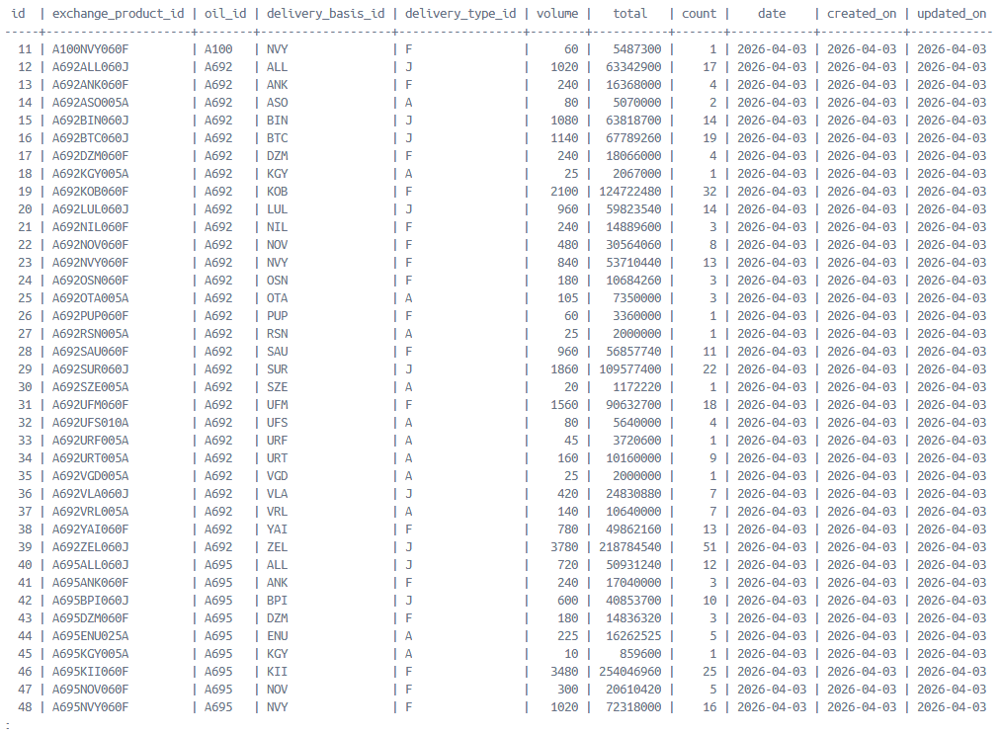
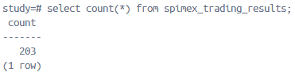

## Тесты работы с базой данных

### Вставка данных в таблицу, обновление строк

```
select id, exchange_product_id, oil_id, delivery_basis_id, delivery_type_id, volume, total, count, date, created_on, updated_on from spimex_trading_results order by id;
```



Количество строк

```
select count(*) from spimex_trading_results;
```



